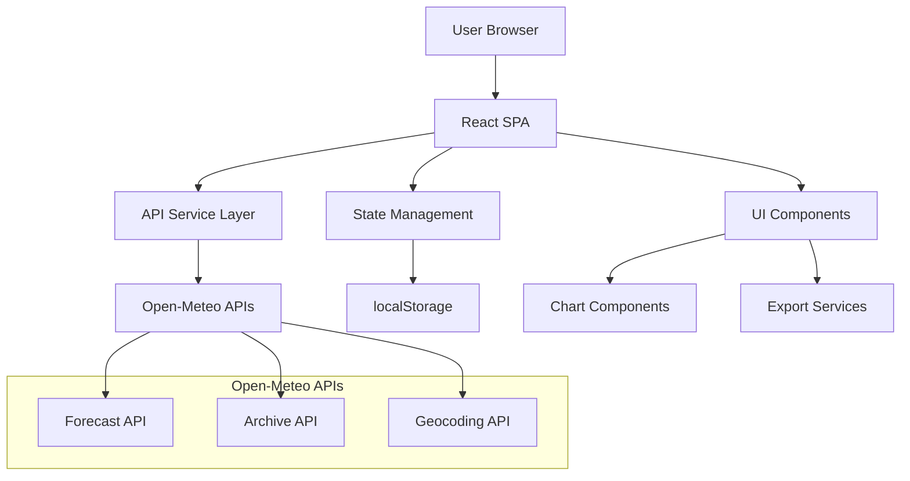

# Design Document

## Overview

The Weather Comparison App is a React-based single-page application that provides side-by-side weather comparisons for up to 3 cities. The application follows a client-side architecture with no backend dependencies, making it suitable for GitHub Pages hosting. The design emphasizes performance through intelligent caching, accessibility through WCAG AA compliance, and user experience through responsive design and multiple visualization modes.

## Architecture

### High-Level Architecture



### Technology Stack

- **Frontend Framework**: React 18 with TypeScript
- **Build Tool**: Vite for fast development and optimized builds
- **Styling**: TailwindCSS for utility-first styling
- **Charts**: Recharts for responsive data visualizations
- **State Management**: React Context + useReducer for global state
- **Storage**: localStorage for persistence
- **Export**: html2canvas for PNG exports, custom CSV generation
- **Hosting**: GitHub Pages (static deployment)

## Components and Interfaces

### Core Components

#### App Component
- Root component managing global state and routing
- Handles initial geolocation and data loading
- Manages theme and settings context

#### LocationManager
- Handles geolocation detection and fallback
- Manages city search with autocomplete
- Validates maximum city limit (3 cities)

#### WeatherDataProvider
- Centralized data fetching and caching
- Manages API calls to Open-Meteo services
- Implements cache invalidation strategies

#### ViewToggle
- Navigation between Summary, Cards, Charts, and Seasonal views
- Manages active view state
- Provides accessibility labels

#### Summary View Components
- **ComparisonSummary**: Displays calculated differences between cities
- **WeatherInsights**: Shows at-a-glance comparisons
- **DifferenceCalculator**: Utility for computing weather differences

#### Cards View Components
- **CityWeatherCard**: Individual city weather display
- **CurrentConditions**: Current weather data display
- **WeeklyForecast**: 7-day forecast display
- **HistoricalSummary**: Past week summary

#### Charts View Components
- **TemperatureChart**: Line chart for temperature trends
- **PrecipitationChart**: Bar chart for precipitation data
- **WindChart**: Line chart for wind data
- **HistoricalChart**: 24-month historical trends
- **ChartControls**: Y-axis scaling and metric toggles

#### Settings Components
- **SettingsPanel**: Units, theme, and preference controls
- **FavoritesManager**: Save and load favorite cities
- **ExportControls**: PNG and CSV export functionality

### API Service Interfaces

#### WeatherService
```typescript
interface WeatherService {
  getCurrentWeather(lat: number, lon: number): Promise<CurrentWeather>
  getWeeklyForecast(lat: number, lon: number): Promise<WeeklyForecast>
  getHistoricalData(lat: number, lon: number, months: number): Promise<HistoricalData>
  searchLocations(query: string): Promise<Location[]>
}
```

#### CacheService
```typescript
interface CacheService {
  get<T>(key: string): T | null
  set<T>(key: string, data: T, ttl: number): void
  invalidate(pattern: string): void
}
```

## Data Models

### Location Model
```typescript
interface Location {
  id: string
  name: string
  country: string
  latitude: number
  longitude: number
  timezone: string
}
```

### Weather Data Models
```typescript
interface CurrentWeather {
  temperature: number
  feelsLike: number
  humidity: number
  windSpeed: number
  windGust: number
  precipitation: PrecipitationData
  cloudCover: number
  pressure: number
  uvIndex: number
  sunrise: string
  sunset: string
  timestamp: string
}

interface PrecipitationData {
  type: 'rain' | 'snow' | 'mixed' | 'none'
  intensity: number
  probability: number
  rate: number
  total1h: number
  total24h: number
}

interface WeeklyForecast {
  daily: DailyForecast[]
}

interface DailyForecast {
  date: string
  tempMin: number
  tempMax: number
  precipitation: PrecipitationData
  humidity: number
  windSpeed: number
  windGust: number
}

interface HistoricalData {
  monthly: MonthlyAverage[]
}

interface MonthlyAverage {
  month: string
  tempMin: number
  tempMax: number
  tempMean: number
  precipitationTotal: number
  precipitationDays: number
  humidity: number
  windSpeed: number
}
```

### Application State Model
```typescript
interface AppState {
  locations: Location[]
  weatherData: Map<string, WeatherData>
  settings: UserSettings
  ui: UIState
}

interface UserSettings {
  units: 'metric' | 'imperial'
  theme: 'light' | 'dark'
  favorites: Location[]
  defaultView: ViewMode
  chartSettings: ChartSettings
}

interface UIState {
  activeView: ViewMode
  loading: boolean
  errors: ErrorState[]
  selectedTimeRange: TimeRange
}
```

## Error Handling

### Error Categories
1. **Network Errors**: API unavailability, timeout, rate limiting
2. **Data Errors**: Invalid responses, missing data fields
3. **User Errors**: Invalid location searches, permission denials
4. **System Errors**: localStorage failures, export errors

### Error Handling Strategy
- **Graceful Degradation**: Show cached data when fresh data unavailable
- **User-Friendly Messages**: Convert technical errors to actionable messages
- **Retry Logic**: Automatic retry with exponential backoff for transient failures
- **Fallback Content**: "Data unavailable" placeholders maintain layout integrity

### Error Recovery
```typescript
interface ErrorBoundary {
  componentDidCatch(error: Error, errorInfo: ErrorInfo): void
  render(): ReactNode
}

interface ErrorRecovery {
  retryOperation(operation: () => Promise<any>, maxRetries: number): Promise<any>
  fallbackToCache(key: string): any
  showErrorMessage(error: AppError): void
}
```

## Testing Strategy

### Unit Testing
- **Components**: React Testing Library for component behavior
- **Services**: Jest for API service logic and caching
- **Utilities**: Pure function testing for calculations and transformations
- **Hooks**: Custom hook testing with React Hooks Testing Library

### Integration Testing
- **API Integration**: Mock Open-Meteo responses for consistent testing
- **localStorage**: Test persistence and retrieval of settings/favorites
- **Chart Rendering**: Verify chart data accuracy and responsiveness

### Accessibility Testing
- **Automated**: axe-core integration for WCAG compliance
- **Manual**: Keyboard navigation and screen reader testing
- **Visual**: Color contrast validation and focus indicator testing

### Performance Testing
- **Bundle Size**: Analyze and optimize JavaScript bundle size
- **Rendering**: Measure component render times and optimize re-renders
- **API Caching**: Verify cache hit rates and invalidation logic

### End-to-End Testing
- **User Flows**: Complete user journeys from location selection to export
- **Cross-Browser**: Testing on major browsers and mobile devices
- **Responsive**: Verify layout and functionality across screen sizes

## Performance Considerations

### Caching Strategy
- **Current/Forecast Data**: 15-minute TTL for real-time relevance
- **Historical Data**: 24-hour TTL for stable historical information
- **Location Search**: 1-hour TTL for geocoding results
- **Chart Data**: In-memory caching for view switching

### Optimization Techniques
- **Code Splitting**: Lazy load chart components and export functionality
- **Memoization**: React.memo for expensive component renders
- **Debouncing**: Search input debouncing to reduce API calls
- **Virtual Scrolling**: For large historical data sets

### Bundle Optimization
- **Tree Shaking**: Remove unused code from dependencies
- **Dynamic Imports**: Load features on demand
- **Asset Optimization**: Compress and optimize static assets
- **CDN Integration**: Leverage GitHub Pages CDN for global distribution

## Security Considerations

### Data Privacy
- **No Server Storage**: All data processing happens client-side
- **localStorage Only**: User preferences stored locally, not transmitted
- **API Keys**: No sensitive API keys (Open-Meteo is free and open)

### Input Validation
- **Location Search**: Sanitize and validate search inputs
- **URL Parameters**: Validate shared link parameters
- **Export Data**: Sanitize data before CSV generation

### Content Security Policy
```typescript
const csp = {
  'default-src': "'self'",
  'connect-src': "'self' https://api.open-meteo.com",
  'img-src': "'self' data:",
  'style-src': "'self' 'unsafe-inline'",
  'script-src': "'self'"
}
```